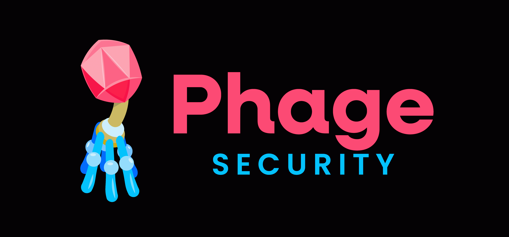

  

---

If you have any questions or are seeking a security review for your project, reach out us at:
- X - [Pyro](https://x.com/0x3b33)
- Telegram - [Pyro](https://t.me/Pyro3b)

---

# Security Engagements
| №  | Date  | Project |  Category | Vulnerabilities | Report | Language |
|:--|:--|:--|:--|:--|:--|:--|
| 10 | 01.2026 | [Spiral Stake](https://x.com/0xspiralstake) | Leveraged stable assets | 1H, 4M | [📑](https://github.com/phage-security/audits/blob/main/2026-01-spiralStake.pdf) |  |
| 9  | 12.2025 | [Poly Lend](https://x.com/poly_lend) | PM + lending | 1H, 2M | private |  |
| 8  | 12.2025 | PandaX | Staking | 2H, 4M | private |  |
| 7  | 12.2025 | [Rug Rumble](https://x.com/RugRumble) | Gambling | - | [📑](https://github.com/phage-security/audits/blob/main/2025-11-ror.pdf) |  |
| 6  | 10.2025 | [Legend.trade](https://x.com/robinmarketsxyz) | trading + megaETH + GTE | 2M | [📑](https://github.com/phage-security/audits/blob/main/2025-10-legend.pdf) |  |
| 5  | 09.2025 | [Robin](https://x.com/robinmarketsxyz) | PM yield generator | 2H | [📑](https://github.com/phage-security/audits/blob/main/2025-09-robin.pdf) |  |
| 4  | 08.2025 | [PinLink](https://pinlink.ai/) | ERC-1155 marketplace | - | [📑](https://github.com/phage-security/audits/blob/main/2025-08-pinlink.pdf) |  |
| 3  | 08.2025 | [Bounce Tech](https://x.com/BounceDotTech) | leveraged token on Hype | 4H, 7M | [📑](https://github.com/phage-security/audits/blob/main/2025-08-Bounce.pdf) |  |
| 2  | 08.2025 | [Foresight](https://x.com/foresightnow) | prediction market | 3H, 2M | [📑](https://github.com/phage-security/audits/blob/main/2025-08-foresight.pdf) |  |
| 1  | 07.2025 | [Hikari](https://x.com/hikari_finance) | UNIv3 positions | 3H, 5M | private |  |